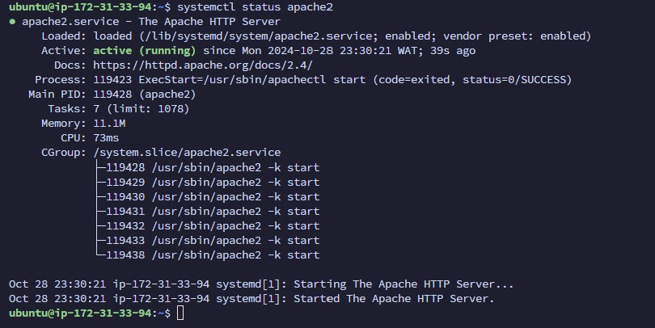

### Setting Up an Apache Web Server with PHP on an AWS EC2 Instance Using Ansible: A Beginner's Walkthrough

#### Introduction

In this project, I used **Ansible** to automate the setup of a web server running **Apache** and **PHP** on an **AWS EC2 instance**. The aim was to use Ansible to configure multiple servers and host a webpage that displays the current date and time. Along the way, I configured the timezone to **Africa/Lagos** and handled some challenges regarding file permissions, default pages, and other settings.

This write-up is aimed at explaining the process to **absolute beginners**. I'll break down every bit of the **inventory** and **playbook** files in detail, so you can understand how to use Ansible to automate server tasks.

#### Getting Started: Using WSL to Enter a Linux Environment

Since I use **Windows**, I needed a Linux environment for Ansible, as it's built primarily for Linux-based systems. To bridge this gap, I used **Windows Subsystem for Linux (WSL)**, which allows you to run a Linux terminal on Windows without needing a separate virtual machine.

- **WSL Installation**: I installed WSL and Ubuntu by running the command below in the **PowerShell** terminal:
  ```bash
  wsl --install
  ```
  This command installs WSL and sets up Ubuntu, which allows me to work in a Linux-like environment on my Windows PC. Once installed, I launched Ubuntu and created a UNIX username.

- **Python Installation**: Ansible relies on Python to execute its commands. Python comes pre-installed in most Linux distributions, but to ensure everything works properly, I ran:
  ```bash
  sudo apt install python3 -y
  ```
  This command installs Python if it's not already present. Ansible uses Python to run tasks on the managed nodes, making it essential for its operations.

- **Ansible Installation**: Once inside the Ubuntu environment, I updated the package list and installed Ansible using the following commands:
  ```bash
  sudo apt update
  sudo apt install ansible -y
  ```
  This ensured that I had Ansible installed and ready to work with.

#### Ansible Inventory File Explained

An Ansible **inventory** file is where we define the servers we want to manage. It tells Ansible what servers to connect to and how to connect to them. In my project, I used three servers:

1. **localhost**: The server running on my WSL environment.
2. **altschool_server**: An AWS EC2 instance.
3. **lxc_server**: An LXC container that I had created locally.

Here is the content of my inventory file:

##### Inventory File: `inventory.yaml`

```yaml
all:
  hosts:
    localhost:
      ansible_connection: local

    altschool_server:
      ansible_host: ec2-51-20-191-169.eu-north-1.compute.amazonaws.com
      ansible_user: ubuntu
      ansible_ssh_private_key_file: /home/mariam/Altschool-keypair-1.pem

    lxc_server:
      ansible_host: 10.87.5.186
      ansible_user: root
      ansible_ssh_private_key_file: /home/mariam/Altschool-keypair-1.pem
```

##### Breaking It Down:

- **`all:`** This is the group name. It means that the following configuration will apply to **all hosts**. You can create different groups like `web_servers`, `database_servers`, etc.

- **`hosts:`** Lists all the servers (or hosts) that we want to manage.

- **`localhost:`** This defines my local machine as a host, using the **connection type `local`** because Ansible is being run on this host itself.
  - **`ansible_connection: local`** tells Ansible to run tasks directly on the local machine without using SSH.

- **`altschool_server:`** This entry represents the EC2 instance I want to configure. The following fields are specified:
  - **`ansible_host:`** The public IP or hostname of the EC2 server.
  - **`ansible_user:`** The SSH user to log in as. For AWS, this is often `ubuntu`.
  - **`ansible_ssh_private_key_file:`** The private key file used for SSH authentication.

- **`lxc_server:`** Represents my LXC container.
  - Similar fields are defined as for the EC2 instance: `ansible_host`, `ansible_user`, and `ansible_ssh_private_key_file`.

The inventory file essentially defines how to **connect** to each server and the **credentials** to use.

#### Ansible Playbook Explained

An **Ansible playbook** is where we define the **tasks** we want Ansible to run on the hosts defined in our inventory. It is written in **YAML** format, which is a straightforward, human-readable language.

##### Playbook File: `playbook.yaml`

```yaml
--- 
- name: Setup a server with Apache & host index.php file
  hosts: all
  become: yes

  tasks: 
    - name: "Install Apache"
      apt: 
        name: apache2
        state: present
        update_cache: yes 

    - name: "Install php"
      apt:
        name: php
        state: present
        update_cache: yes

    - name: Set the server timezone to Africa/Lagos
      command: timedatectl set-timezone Africa/Lagos

    - name: Create index.php file with date display
      copy:
        dest: /var/www/html/index.php
        content: |
          <?php
          date_default_timezone_set("Africa/Lagos");
          echo date("F d, Y h:i:s A e", time());
          ?>

    - name: Ensure Apache is started and enabled
      service:
        name: apache2
        state: started
        enabled: yes

    - name: Set index.php as the default directory index
      replace:
        path: /etc/apache2/mods-enabled/dir.conf
        regexp: '^\s*DirectoryIndex .*'
        replace: 'DirectoryIndex index.php index.html index.cgi index.pl index.xhtml index.htm'
      notify: Restart Apache

  handlers:
  - name: Restart Apache
    service:
      name: apache2
      state: restarted
```

##### Breaking It Down:

- **`---`**: This indicates the beginning of the YAML file.

- **`- name: Setup a server with Apache & host index.php file`**: This is the name of the **play**. A play is like a group of tasks to run on specified hosts.

- **`hosts: all`**: This line tells Ansible which hosts to run these tasks on. In this case, `all` means every host listed in the inventory file will be targeted.

- **`become: yes`**: This tells Ansible to use **sudo privileges** for the tasks (i.e., run as root).

##### Tasks Section

The **`tasks:`** section lists the different steps we want to perform on the hosts:

1. **Install Apache**:
   - **`name: Install Apache`**: Each task has a descriptive name.
   - **`apt:`**: This is a module that works with **Debian-based** systems like Ubuntu to install software.
     - **`name: apache2`**: The package we want to install.
     - **`state: present`**: This means that Apache should be installed if it isn’t already.
     - **`update_cache: yes`**: Update the package list before installing Apache.

2. **Install PHP**:
   - Similar to installing Apache, but here we install **PHP**, which is necessary for serving dynamic content.

3. **Set the Server Timezone**:
   - **`command: timedatectl set-timezone Africa/Lagos`**: The `command` module runs a command on the target hosts. In this case, we use `timedatectl` to set the timezone to `Africa/Lagos`.

4. **Create `index.php` File**:
   - **`copy:`**: The **copy** module allows us to copy content to a file on the target hosts.
   - **`dest: /var/www/html/index.php`**: Specifies the destination file for Apache.
   - **`content:`**: Contains the content of the PHP script. This script sets the timezone to `Africa/Lagos` and prints the current date and time in the specified format.

5. **Ensure Apache is Started and Enabled**:
   - **`service:`**: The **service** module is used to manage system services like Apache.
   - **`name: apache2`**: The name of the service.
   - **`state: started`**: Make sure the service is running.
   - **`enabled: yes`**: Make sure the service starts on boot.

   

6. **Set `index.php` as the Default Directory Index**:
   - **`replace:`**: The **replace** module replaces the existing `DirectoryIndex` configuration line to set `index.php` as the first page to load.
   - **`path: /etc/apache2/mods-enabled/dir.conf`**: The file we want to modify.
   - **`regexp: '^\s*DirectoryIndex .*'`**: A regular expression to find the line starting with `DirectoryIndex`. Using `^\s*` ensures we match even if there are leading spaces.
   - **`replace: 'DirectoryIndex index.php index.html index.cgi index.pl index.xhtml index.htm'`**: The new line to replace the existing one, giving `index.php` priority over other files.
   - **`notify: Restart Apache`**: This triggers a **handler** to restart Apache after the modification.

##### Handlers Section

- **Handlers** are used to run actions only when notified. In this case, we have a handler to **restart Apache**:
  - **`name: Restart Apache`**: The name of the handler.
  - **`service:`**: The service module to manage Apache.
  - **`state: restarted`**: Restart Apache to apply the changes.

#### Running the Playbook

To run the playbook, I used the following command in the WSL terminal:

```bash
ansible-playbook -i inventory.yaml playbook.yaml
```

This command tells Ansible to use the inventory file (`inventory.yaml`) and run the tasks in the playbook file (`playbook.yaml`).

#### Challenges I Faced

- **SSH Key Issues**: I faced issues with the permissions on the **SSH key** file while trying to connect to the EC2 instance. To fix it, I set proper permissions using:
  ```bash
  chmod 400 /home/mariam/Altschool-keypair-1.pem
  ```

- **Apache Default Page vs. PHP Page**: After configuring Apache, visiting the server IP would show the default Apache page instead of the `index.php` file I had created. This was because **Apache gives priority** to `index.html` over `index.php`. To solve this, I initially used the **`lineinfile`** module to modify the **Apache configuration** to prioritize `index.php` over `index.html`. However, this approach worked on my LXC servers but **did not work on the EC2 instance**. After troubleshooting, I found that the **`lineinfile`** module was not effectively modifying the `dir.conf` file on the EC2 instance, potentially due to file system limitations or permission issues. Instead, I used the **`replace`** module, which successfully updated the `dir.conf` file.

- **Timezone Configuration**: Initially, the webpage displayed a different timezone (`Africa/Brazzaville`) instead of `Africa/Lagos`. After checking the PHP configuration file (`php.ini`), I found that no default timezone was set, and I updated it using Ansible to ensure consistency.

#### Results

After completing the configuration, I was able to visit the public IP of my EC2 instance and see the following output:


I had to add `/index.php` to the URL initially because Apache’s default configuration prioritized `index.html` over `index.php`. By modifying the **Apache directory index settings**, I resolved this and ensured that `index.php` loaded first.

#### Summary

This project was an exercise in using Ansible to **automate server setup**. We wrote an inventory file to define our servers and used an Ansible playbook to configure Apache, install PHP, set the correct timezone, and serve dynamic content with a PHP script.

The experience taught me the following key points:
- How to use **WSL** for a Linux environment on Windows.
- Writing and using **Ansible inventory and playbooks**.
- Addressing **common server issues**, including permissions, time zone configuration, and service management.
- Troubleshooting the **Apache server** to ensure correct file precedence.

In my next write-up, I will document how I **provisioned the LXC instance**, detailing every step for an absolute beginner to understand containerized instances and how to manage them using Ansible.

